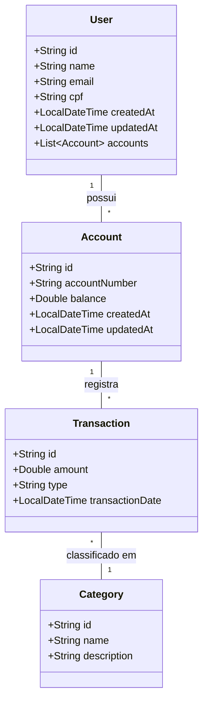

```mermaid
classDiagram
    class User {
      +String id
      +String name
      +String email
      +String cpf
      +LocalDateTime createdAt
      +LocalDateTime updatedAt
      +List~Account~ accounts
    }

    class Account {
      +String id
      +String accountNumber
      +Double balance
      +LocalDateTime createdAt
      +LocalDateTime updatedAt
    }

    class Transaction {
      +String id
      +Double amount
      +String type
      +LocalDateTime transactionDate
    }

    class Category {
      +String id
      +String name
      +String description
    }

    %% Relacionamentos entre classes
    User "1" -- "*" Account : possui
    Account "1" -- "*" Transaction : registra
    Transaction "*" -- "1" Category : classificado em

```

